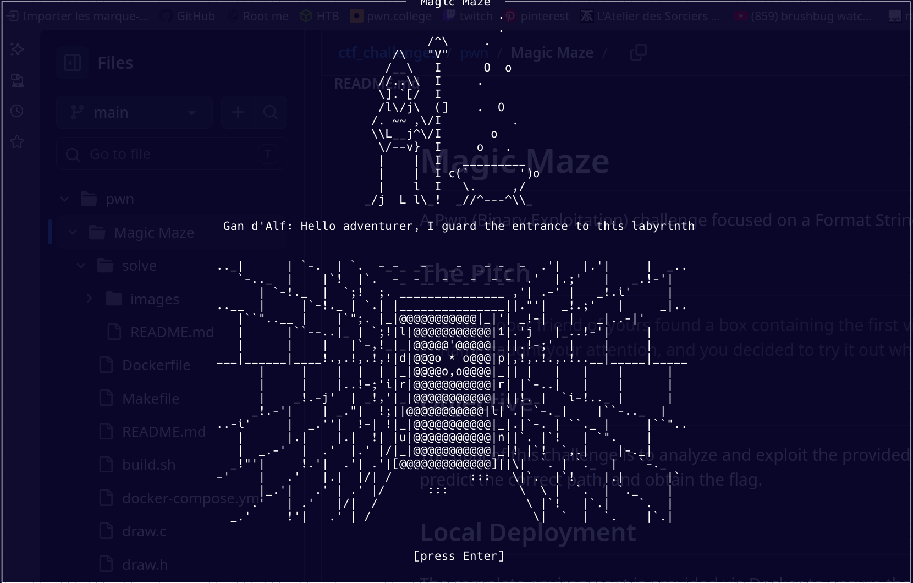
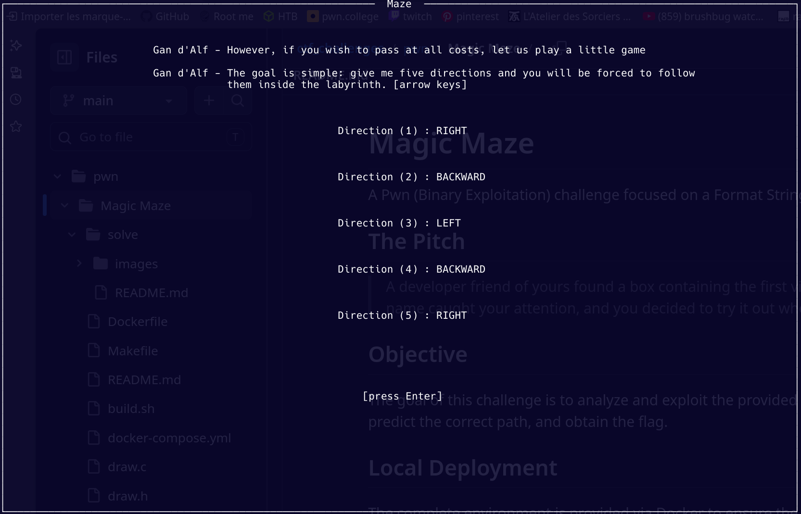
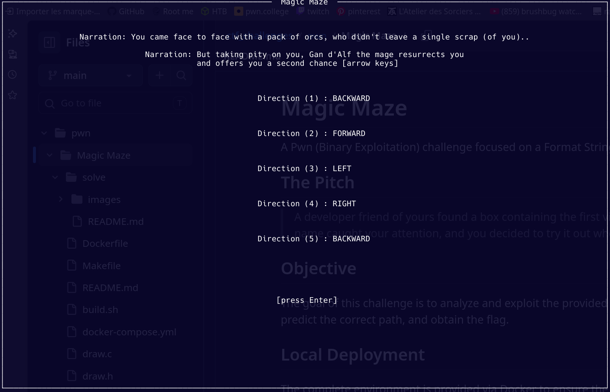
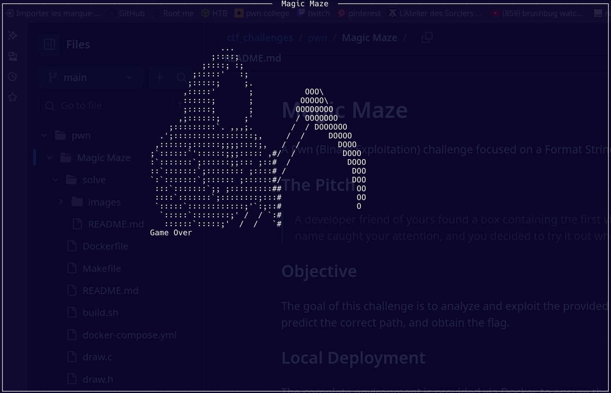

# Magic Maze

A Pwn (Binary Exploitation) challenge focused on a Format String vulnerability.

## The Pitch

> A developer friend of yours found a box containing the first video games he ever coded, and among them was Magic Maze.
> The name caught your attention, and you decided to try it out when you got home...

## Objective

The goal of this challenge is to analyze and exploit the provided binary by leveraging a format string vulnerability to leak memory, predict the correct path, and obtain the flag.

## Local Deployment

The complete environment is provided via Docker to ensure the challenge is reproducible. 
To start the server locally:

```bash
./build.sh
docker-compose up -d
```
Once the server is running, you can connect to the remote service. 
Please launch the challenge in a full-screen terminal: 

```bash
stty raw -echo; nc localhost 9003; reset;
```




