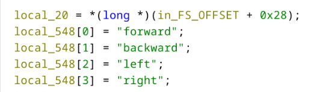
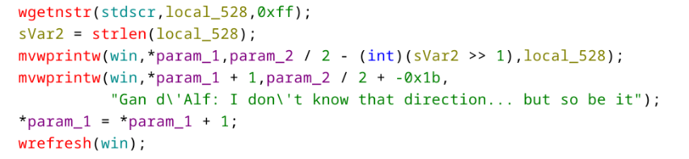
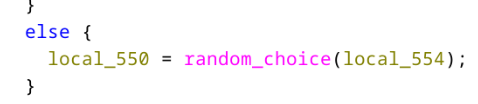
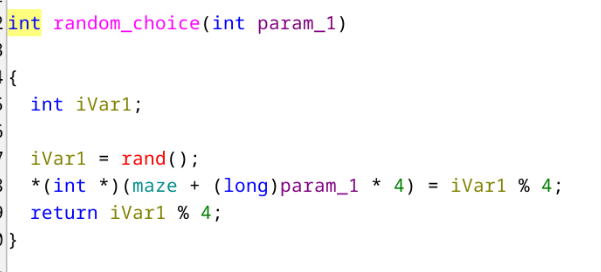
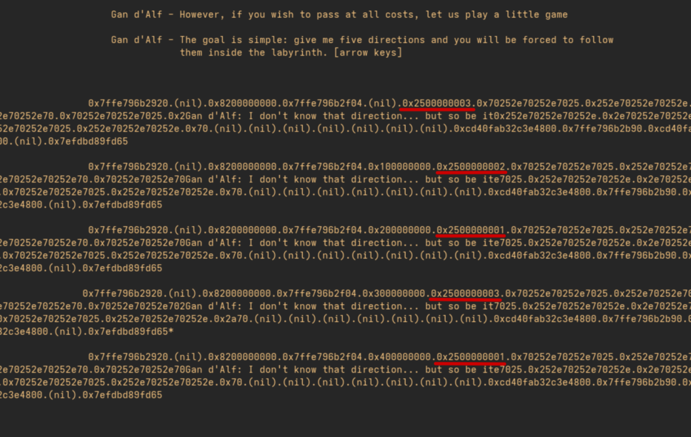
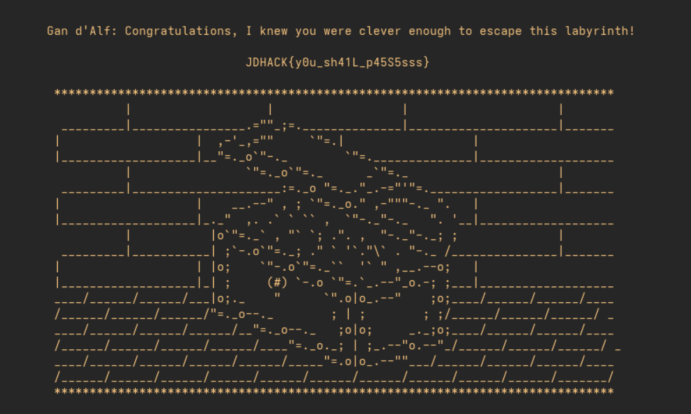

# Write Up

The goal of the challenge was to exploit a Format String vulnerability. This occurs when a call to the printf function is made without using a format string, passing user input directly as an argument instead. If the user injects format specifiers (like %x, %s, or %n)  they can arbitrarily read or write to the program's memory
In the main function, we notice a call to handle_direction :

 

At the beginning of this function, an array is defined containing all possible movements :

 

When a user inputs something other than one of the four directional arrows, their input is displayed as is :

 

This is where the vulnerability lies. mvwprintw works like printf; by displaying user input without a format string, we can read the program's memory. Furthermore, during the first attempt, the chosen direction i is stored in a variable via the call to random_choice :

 

 

At each iteration, the return value of random_choice ends up on the stack. If we leak the memory, we can recover each position from the first phase by using an input like
```%p.%p.%p.%p.%p.%p.%p.%p.%p.%p```, we then get the following output:

 

Finally thanks to the array defined earlier we can deduce the correct movements to use during the second chance given by the mage, and we obtain the flag.

 
