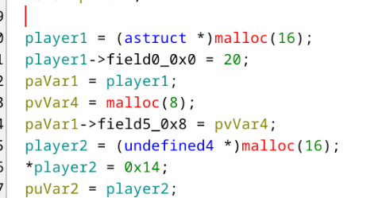
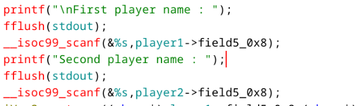
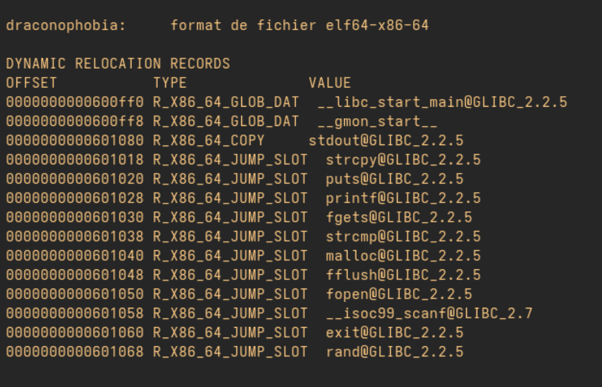
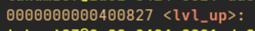
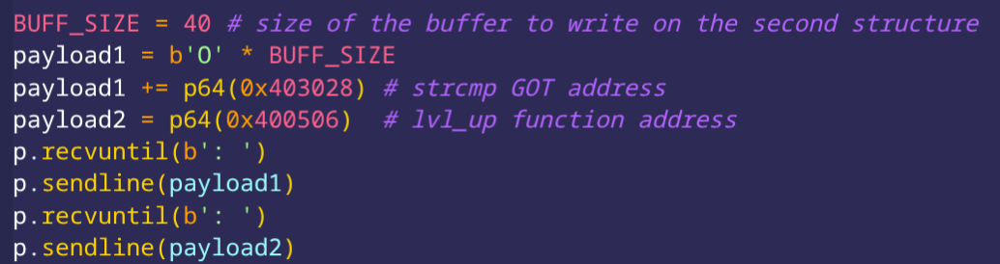

By observing the main function, we notice two variables that resemble structures. Using Ghidra's automatic structure generation tool, we get:



This field initially has a size of 8 as indicated by the malloc, but no size check is performed, which introduces a heap overflow.



To obtain the flag, it is necessary to successfully execute the ```lvl_up``` function.

The first step is to calculate the number of bytes required to write into the second structure from the scanf that is supposed to write only into the ```pseudo``` field of the first structure.

To do this, we can run the program with a debugger, place a breakpoint before the end of the program, provide two arguments, and then observe in memory where ```search arg..``` is located in order to calculate the exact offset.

In a second step, we observe that ```PIE``` is not enabled. The addresses of the different functions are therefore not randomized.
The idea is then to make a field of the second structure point to the ```GOT``` address of the strcmp function, which will be executed later.

Output of command ```objdump -R draconophobia``` : 



Output of command ```objdump -D draconophobia | grep lvl_up``` : 



Next, we provide, as the second argument, the address of the `lvl_up` function, which will be written in place of the `strcmp` address in the GOT. 
During the next call to `strcmp`, the `lvl_up` function will be executed instead.

Then you got this exploit : 



This way, we obtain the flag `JDHACK{41du1n_WIlL_N3ver_w!n}`.


