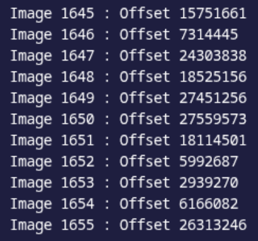

# Blind Distribution

The sources for the challenge are available [here](../).

> Your nephew was thrilled to have recorded his very first video of his favorite game. Unfortunately, he spilled coffee all over his laptop, and now his video isn’t loading correctly anymore… Help him recover the original footage!

You will find the flag by watching the video `gameplay.mp4` once it has been restored to its original state.

In the resolution of navi’s mania, we explored the composition of mp4 files. But what is the link between this black screen and the various atoms that make up the file?

There are several reasons why an MP4 player might fail to display any image while still playing the audio track. In this case, we need to focus on the `stco` atom (Chunk Offset Box).

This is one of the most important atoms, as it indicates for each video chunk which offset within the `mdat` atom to go to in order to find the corresponding data.

A chunk is a set of one or more frames (an image). In an MP4 file, to prevent the player from constantly jumping back and forth between the audio and video tracks, the data is split into these small blocks called chunks. Therefore, you usually find a video chunk, followed by an audio chunk, and so on, interleaved within the `mdat` atom.

Thus, the `stco` atom contains a table that lists the exact location of each chunk:

```text
Chunk 1 -> Offset X
Chunk 2 -> Offset Y
…
```
Without these indexes, the player cannot know where the raw data starts and ends within the `mdat`, rendering the video unplayable.

When analyzing the `stco` box:



We notice that the offsets associated with the different chunks are out of order. However, in a standard MP4 file, these addresses within the `stco` atom must almost systematically appear in ascending order, as they follow the physical progression of the data in the `mdat` atom.

By simply sorting this list to put the addresses back into the correct numerical order, we realign the playback with the actual position of the data on the disk, allowing the original video to be recovered.

It gives us this solve script :

```python
# [Insert your solve script here]
```
