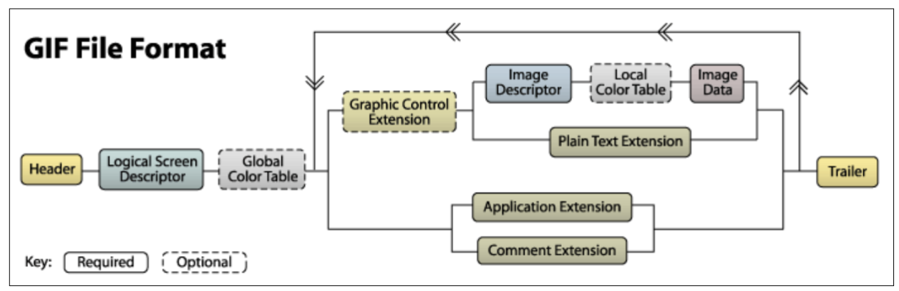
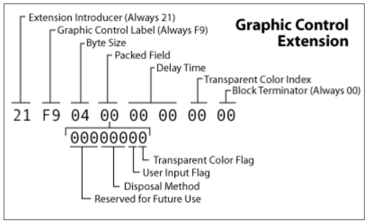
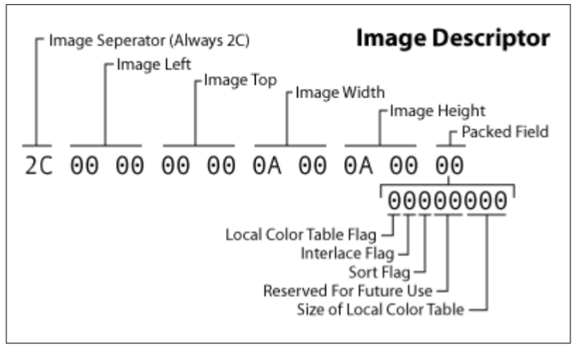

## Description

> You are on vacation in a distant country, but you’ve forgotten your hotel room password... You wander through the city, hoping it will eventually come back to you.
>
> The flag is hidden within the data of the goofy_fantasy.gif file. You must study the GIF file structure to find it.

## Write-Up

GIF files are organized in the following way:



Following the ```Global Color Table``` , we find the data associated with all the images included in the GIF file. Each image therefore corresponds to a loop that includes all the components located between the ```Global Color Table``` and the ```trailer```.

The trailer is the byte that marks the end of the GIF file: 0x3B.

Among these blocks, let’s study the composition of the ```Graphic Control Extension```, as well as the ```Image Descriptors``` :

```Graphic Control Extension``` : 



This optional block contains a ```Packed Fields``` byte. Bits 5, 6, and 7 are marked as "Reserved" (reserved for future use) and are normally set to zero.

```Image Descriptor``` : 



This block also contains a ```Packed Fields``` byte (located at offset 9 of the block). Here, bits 3 and 4 are defined as "Reserved".

Both components possess "unused" bits where data can be discreetly introduced without altering the file's rendering. However, the documentation indicates that the Graphic Control Extension block is optional. A GIF file can theoretically contain none at all.

To check the values of these different bits, a parser must be written. You will find a schematized summary of the GIF89a standard at this address : https://giflib.sourceforge.net/whatsinagif/bits_and_bytes.html. Once parsed (see ```solve.py```), we notice that these reserved bits only fluctuate starting from a specific image x and only within the Image Descriptors.

Thus, by collecting all the reserved bits from each Image Descriptor and concatenating them, the flag is retrieved in ASCII format.


