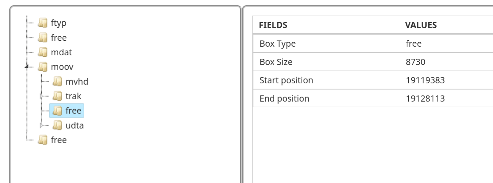
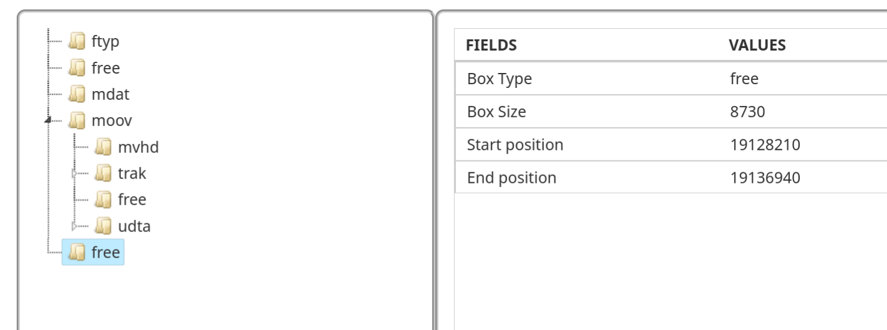

# Navi's Mania

>Link is trapped in a time loop by the Calamity. He has been opening this chest for eternity, yet it remains hopelessly empty. It is up to you to >analyze this dream and extract its true contents
>
>The flag is hidden within an MP4 file. You must study the structure of MP4 files to find it.

## MP4 file’s structure

MP4 files are organized into boxes. Each box contains other boxes, which together form the file’s ecosystem. Each one has a different purpose, a specific size, and a precise type.

An important example of a box is `mdat`: this one contains all the raw data related to the file’s audio and images.

A box header is always at least 8 bytes long:
* The first 4 bytes define the total Size of the box.
* The next 4 bytes define the Type (its name in 4 ASCII characters).

Therefore, to navigate through the tree structure, you simply need to read the size and the name of the box. If it interests us, we “enter” it by reading the following 8 bytes; otherwise, we move forward by the size of the entire box.

Here is the nesting of these boxes according to the ISO/IEC 14496-12 standard:


Furthermore, generally all information related to the video is found in two `trak` atoms: one for audio data and one for video data.

When an MP4 file contains multiple tracks, almost all players offer an option to switch between the different tracks contained within the same file.

## Incoherence 

When using a tool to parse the entire file for a surface view (https://www.onlinemp4parser.com/) we got :




In an MP4 file, the `free` (or `skip`) atom is a reserved or “empty” space that contains no multimedia data usable by the player. It mainly serves as a buffer zone: editing software uses it to adjust the file size or insert metadata without having to rewrite the entire content, which makes processing much faster.

We notice two very strange things: first, the second `free` atom is exactly the same size as the one following the first `trak`.

Firstly, a `free` atom of this size is completely unusual. As explained previously, these atoms normally serve as a buffer zone (padding) for data alignment and generally do not exceed a few bytes.

Additionally, `trak` atoms are usually placed next to each other within the `moov` atom. It should also be noted that media players, when encountering a `free` atom, skip over it directly without trying to find out what it contains.

We can then deduce that the `free` atom following the second `trak` was actually the track containing the flag. Only the name of the atom was changed.

So, is it enough to just rename it back to `trak`? 
Actually no, we quickly realize that the data present there has been randomized. It was then necessary to copy all the data present in the last `free` atom, which is in fact a copy of the original `trak` representing the video to be recovered.

Furthermore, to be sure, by analyzing the content of the second `free` atom, we found the structure of a track atom.

The final step is to insert it in place of the `free` atom following the first `trak` and rename the atom to `trak`.

See ```solve.c``` for more details.
